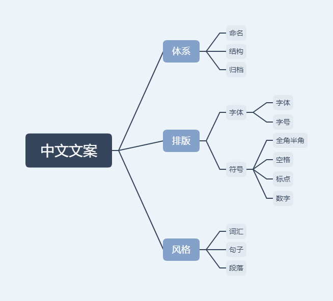

# 中文文案风格指南

统一中文文案体系、排版、风格的相关用法，降低团队成员沟通成本并统一团队风格。

## **目录**

- [命名](docs/命名.md)
- [结构](docs/结构.md)
- [归档](docs/归档.md)
- [字体](docs/字体.md)
- [字号](docs/字号.md)
- [全角半角](docs/全角半角.md)
- [空格](docs/空格.md)
- [标点](docs/标点.md)
- [数字](docs/数字.md)
- [词汇](docs/词汇.md)
- [句子](docs/句子.md)
- [段落](docs/段落.md)

## 参考

[全角和半角](https://zh.wikipedia.org/wiki/全形和半形)、维基百科

[文案风格指南](https://open.leancloud.cn/copywriting-style-guide/)、LeanCloud 开放资源

[中文排版需求](https://w3c.github.io/clreq/#)、W3C

[中文文案排版指南](https://github.com/mzlogin/chinese-copywriting-guidelines)、mzlogin

[写作规范和格式规范](http://guide.daocloud.io/dcs/%E5%86%99%E4%BD%9C%E8%A7%84%E8%8C%83%E5%92%8C%E6%A0%BC%E5%BC%8F%E8%A7%84%E8%8C%83-9153803.html)、DaoCloud Wik

[为什么文件名要小写？](http://www.ruanyifeng.com/blog/2017/02/filename-should-be-lowercase.html)、阮一峰

[中文技术文档的写作规范](http://www.ruanyifeng.com/blog/2016/10/document_style_guide.html)、阮一峰

[為什麼你們就是不能加個空格呢？](https://github.com/vinta/pangu.js)、vinta

中华人民共和国国家标准标点符号用法 GB/T 15834—2011

中华人民共和国国家出版物上数字用法 GB/T 15835—2011

## 贡献

欢迎各位提供建议以及 PR。

## 许可证

公共领域（public domain）

